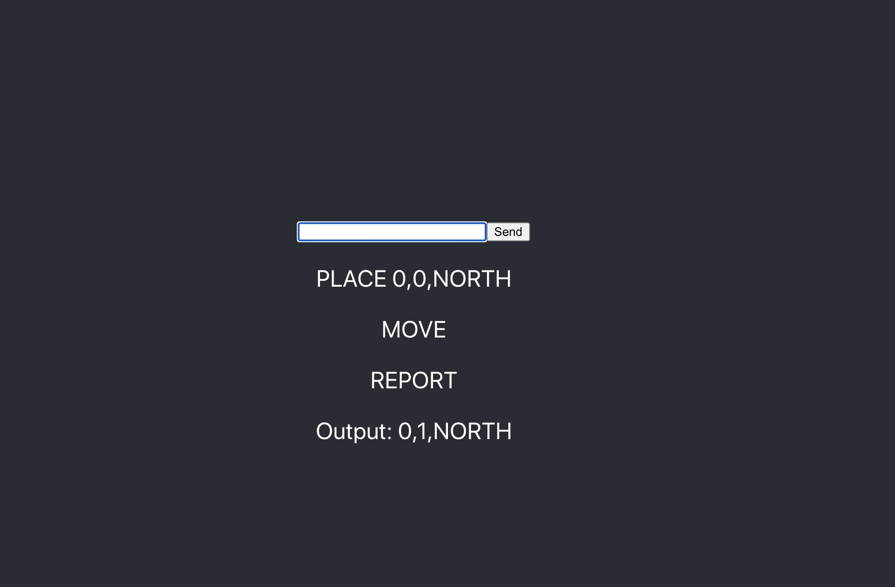
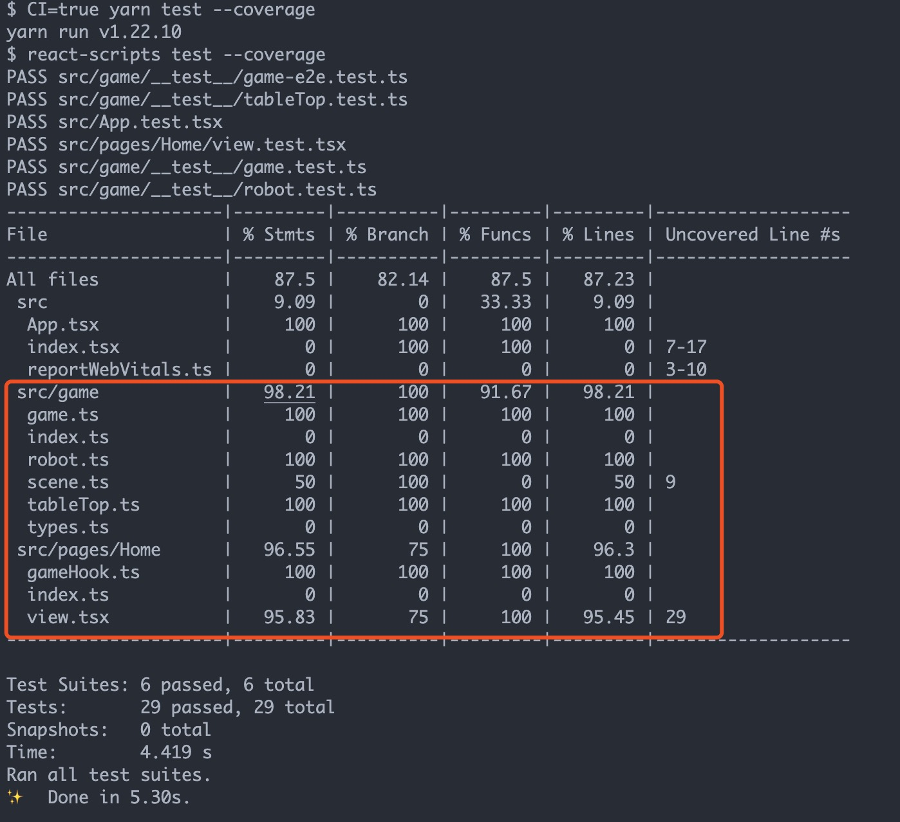

# Toy Robot Simulator based on Create React App and Typescript

## Introduction
This is a demo code for toy robot simulator based on react and typescript with proper tests, including jest and react testing library.

## How to run
1. Clone your repo to your local folder
2. Run `yarn start`
   

## Feature
- [x] React UI
- [x] Proper error handling 
- [x] Over 95% test coverage
- [x] Clear code structure
- [x] Clear git commit history (Semi-linear)

### Screenshots
UI: You can press `Enter` to execute cmd

Tests: 
